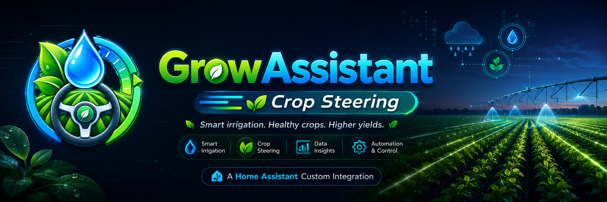

<p align="center">
  
</p>

# GrowAssistant – Crop Steering

[](https://github.com/TheFreakPinny/ha-growassistant-crop-steering/actions/workflows/hassfest.yml)
[](https://github.com/TheFreakPinny/ha-growassistant-crop-steering/actions/workflows/hacs.yml)

**GrowAssistant – Crop Steering** is a Home Assistant custom integration for substrate-based crop steering, irrigation diagnostics, VWC-driven irrigation decisions, and optional Blueprint-based shot control.

The integration provides Home Assistant entities for P0/P1/P2/P3 crop steering logic, irrigation state, soak timing, shot counters, VWC thresholds, drain safety, debugging, and cycle management.

> [!IMPORTANT]
> GrowAssistant does **not** currently contain a native Python pump-on irrigation engine.
>
> Pump activation is performed only by the optional Home Assistant Shot Engine Blueprint or by user-created automations.
>
> Real irrigation hardware must always have an independent physical/electrical failsafe.

---

## Current release

**Current version: `v0.1.13`**

The current release includes:

- Integration-managed numeric Crop Steering settings.
- Direct numeric input fields instead of sliders.
- Integration-managed P1 state switches.
- Integration-managed P1/P2 shot counters.
- Integration-managed P3 Emergency settings and shot counter.
- Integration-managed Last Shot timestamp.
- Automatic cycle reset at the start of every light cycle.
- P0, P1, P2 and P3 phase calculation.
- Multi-sensor VWC averaging.
- P1 and P2 steering modes.
- P1 automatic start readiness.
- Explicit P1 completion.
- P2 VWC-drop based readiness.
- P3 Emergency Dryback Shots.
- Drain and Drain Tray safety handling.
- Detailed phase-aware debug diagnostics.
- Optional Home Assistant Shot Engine Blueprint.
- Home Assistant service buttons.
- HACS installation support.
- Home Assistant Config Flow and Options Flow.
- Integration branding.

---

# Architecture

GrowAssistant separates **decision logic** from **pump execution**.

```text
Home Assistant sensors / helpers
              │
              ▼
┌─────────────────────────────────┐
│ GrowAssistant Integration       │
│                                 │
│ • Phase calculation             │
│ • VWC evaluation                │
│ • P1/P2/P3 readiness            │
│ • Shot counters                 │
│ • Soak timers                   │
│ • Drain safety                  │
│ • Debug diagnostics             │
│ • Cycle reset                   │
└─────────────────────────────────┘
              │
              ▼
      Diagnostic entities
              │
              ▼
┌─────────────────────────────────┐
│ Optional Shot Engine Blueprint  │
│                                 │
│ • Pump ON                       │
│ • Shot duration                 │
│ • Pump OFF                      │
│ • Counter increment             │
│ • Last Shot update              │
└─────────────────────────────────┘
              │
              ▼
        Irrigation pump
```

The integration itself decides whether irrigation **may** occur.

The optional Blueprint performs the actual irrigation shot.

---

# Installation

## HACS custom repository

1. Open **HACS** in Home Assistant.
2. Go to **Integrations**.
3. Open the three-dot menu.
4. Select **Custom repositories**.
5. Add:

```text
https://github.com/TheFreakPinny/ha-growassistant-crop-steering
```

6. Select category:

```text
Integration
```

7. Install **GrowAssistant – Crop Steering**.
8. Restart Home Assistant.
9. Open:

```text
Settings → Devices & services → Add integration
```

10. Search for:

```text
GrowAssistant – Crop Steering
```

11. Complete the setup flow.

---

## Manual installation

Copy:

```text
custom_components/growassistant_crop_steering/
```

to:

```text
/config/custom_components/growassistant_crop_steering/
```

Restart Home Assistant and add the integration through:

```text
Settings → Devices & services → Add integration
```

---

# Integration domain

```text
growassistant_crop_steering
```

---

# Initial configuration

During setup GrowAssistant asks for the external Home Assistant entities required to calculate irrigation state.

## Required entities

### Pump switch

Accepted domains:

```text
switch
input_boolean
```

Use:

```text
switch
```

for a real irrigation pump.

Use:

```text
input_boolean
```

for safe dry-run testing.

The integration itself does not automatically turn this entity on.

---

### VWC sensors

Domain:

```text
sensor
```

One or multiple VWC sensors can be selected.

When multiple sensors are configured:

```text
VWC Average =
sum(valid VWC sensors)
──────────────────────
number of valid sensors
```

Unknown, unavailable and non-numeric sensor values are ignored.

If no valid configured VWC sensor remains available, VWC-dependent irrigation logic fails closed.

---

### LED Sunrise

Domain:

```text
input_datetime
```

Recommended configuration:

```text
Time only
```

Example:

```text
19:00:00
```

---

### LED Sunset

Domain:

```text
input_datetime
```

Recommended configuration:

```text
Time only
```

Example:

```text
07:00:00
```

GrowAssistant supports light schedules that cross midnight.

Example:

```text
Sunrise: 19:00
Sunset:  07:00
```

---

## Optional entities

### Drain Sensor

Domain:

```text
binary_sensor
```

Used as an irrigation/runoff indicator.

Behavior depends on the current phase.

#### P1

A configured Drain Sensor may complete P1 when wet.

An unavailable configured Drain Sensor blocks safely.

#### P2

The normal Drain Sensor is diagnostic-only.

It does **not** block P2 irrigation when wet or unavailable.

#### P3 Emergency

The normal Drain Sensor does **not** block P3 Emergency irrigation.

---

### Drain Tray Sensor

Domain:

```text
binary_sensor
```

The Drain Tray is treated as a safety device.

A configured Drain Tray must be:

```text
configured
available
dry
```

for irrigation to be allowed.

The Drain Tray is fail-closed during P1, P2 and P3 Emergency.

---

# Crop Steering phases

The phase sensor can report:

```text
off
pre_on
p0_transpiration
p1_morning
p2_midday
p3_dryback
```

Typical cycle:

```text
Light ON
   │
   ▼
P0 Transpiration
   │
   ▼
P1 Morning
   │
   ▼
P2 Midday
   │
   ▼
P3 Dryback
   │
   ▼
Light OFF
```

---

# P0 – Transpiration

P0 begins when the grow light turns on.

The purpose of P0 is to allow the plant to begin transpiring before irrigation starts.

Configurable setting:

```text
P0 Transpiration
```

After the configured P0 duration expires, GrowAssistant evaluates whether P1 may begin.

---

# P1 – Morning irrigation

P1 is responsible for the initial morning irrigation / substrate refill phase.

Two steering modes are available:

```text
sensor
manual
```

## Sensor mode

Sensor mode evaluates substrate VWC and irrigation state.

Typical P1 requirements include:

```text
P1 window active
P1 not done
valid VWC
VWC <= P1 Start VWC
soak finished
shots remaining
Drain Tray safe
```

When all start conditions are satisfied, the optional Blueprint may call:

```text
growassistant_crop_steering.start_p1
```

This prepares P1 state but does **not** turn on the pump.

The first irrigation shot occurs only on a later Blueprint trigger.

---

## P1 completion

P1 can complete when one of the configured irrigation targets is reached.

Examples:

```text
Maximum P1 shots reached
Field Capacity reached
Drain Sensor becomes wet
```

Completion is performed through:

```text
growassistant_crop_steering.complete_p1
```

The service:

```text
captures current averaged VWC
→ stores it as P2 Reference VWC
→ enables P1 Done
→ disables P1 Active
```

If no valid VWC sensor is available, completion fails closed.

---

# P2 – Midday irrigation

P2 maintains substrate moisture after P1.

The main sensor-mode trigger is based on dryback from the stored P2 Reference VWC.

Conceptually:

```text
P2 Reference VWC
        │
        ▼
Configured VWC Drop
        │
        ▼
P2 irrigation threshold
```

Example:

```text
P2 Reference VWC = 60 %
P2 VWC Drop      = 5 %

P2 threshold     = 55 %
```

A shot may become ready when:

```text
current VWC <= 55 %
```

and all additional safety conditions pass.

---

## P2 fail-closed pump gating

The optional Blueprint requires:

```text
Block Reason == "P2 ready"
```

before starting a P2 shot.

Missing, unavailable, unknown, empty or blocked states prevent pump activation.

Additional checks include:

```text
phase == p2_midday
soak finished
shots remaining
positive shot target
pump off
Drain Tray configured and safe
```

---

# P3 – Dryback

P3 represents the dryback period after normal P2 irrigation has ended.

Phase:

```text
p3_dryback
```

Normal irrigation is stopped during this phase.

GrowAssistant optionally supports **P3 Emergency Dryback Shots** to protect the substrate from drying below a configured emergency threshold.

---

# P3 Emergency Dryback Shots

P3 Emergency remains inside:

```text
p3_dryback
```

No additional phase is created.

The feature can be enabled or disabled with the integration-managed P3 Emergency switch.

A P3 Emergency shot becomes ready when all required conditions pass.

Conceptually:

```text
phase == p3_dryback
Emergency enabled
valid VWC <= emergency threshold
soak finished
shots done < maximum shots
shot duration > 0
pump off
Drain Tray configured
Drain Tray available
Drain Tray dry
```

Then:

```text
P3 Emergency Ready
        │
        ▼
Blueprint starts one shot
        │
        ▼
Pump OFF
        │
        ▼
Emergency Shots Done +1
        │
        ▼
Last Shot updated
        │
        ▼
Emergency soak timer
        │
        ▼
VWC reevaluated
```

If the substrate is still below the emergency threshold after soak and shots remain available, another emergency shot may become eligible.

---

## P3 safety behavior

The normal Drain Sensor:

```text
does not block P3 Emergency
```

The Drain Tray:

```text
is mandatory for P3 Emergency readiness
```

A missing, unavailable or wet configured Drain Tray prevents emergency irrigation.

---

# Automatic cycle reset

GrowAssistant automatically resets daily steering state once when a new LED light cycle begins.

The reset occurs at the configured LED Sunrise.

The following values are reset:

```text
P1 Active
P1 Done
P1 Window Opened Today
P1 Shots Done
P2 Shots Done
P2 Reference VWC
P3 Emergency Shots Done
```

The following value is preserved:

```text
Last Shot
```

A persistent cycle marker prevents duplicate resets after Home Assistant restarts.

If Home Assistant starts during an already active light cycle and the reset was missed, GrowAssistant performs the reset once.

Overnight light schedules are supported.

---

# Integration-managed entities

GrowAssistant creates its own Home Assistant entities for most steering parameters.

New installations do not need separate `input_number`, `counter` or `input_boolean` helpers for these values.

---

## Numeric settings

All integration-managed numeric entities use direct numeric input fields:

```text
NumberMode.BOX
```

instead of sliders.

### P0

```text
P0 Transpiration
```

### P1

```text
P1 Duration
P1 Interval
P1 Shot Duration
P1 Soak
P1 Start VWC
P1 Shots
P1 Shots Done
```

### P2

```text
P2 Interval
P2 Shot Duration
P2 Soak
P2 Shots
P2 Shots Done
P2 End Offset
P2 VWC Drop
P2 Reference VWC
```

### General VWC

```text
Field Capacity VWC
VWC Cap
VWC Hysteresis
```

### P3 Emergency

```text
P3 Emergency Threshold VWC
P3 Emergency Shot Duration
P3 Emergency Soak
P3 Emergency Max Shots
P3 Emergency Shots Done
```

---

# Integration-managed switches

GrowAssistant creates editable switch entities for persistent steering state.

## P1

```text
P1 Active
P1 Done
P1 Window Opened Today
```

## P3 Emergency

```text
P3 Emergency Enabled
```

These states survive Home Assistant restarts.

---

# Last Shot

GrowAssistant stores the timestamp of the most recent irrigation shot internally.

Sensor:

```text
Last Shot
```

The timestamp is used for soak calculations.

The optional Blueprint updates Last Shot automatically after a completed irrigation shot.

External automations can update it using:

```text
growassistant_crop_steering.set_last_shot_now
```

---

# Diagnostic sensors

GrowAssistant exposes several diagnostic entities.

## Status

Reports integration readiness.

---

## Phase

Reports the currently active Crop Steering phase.

---

## P1 Soak Remaining

Reports remaining P1 soak time.

---

## P2 Soak Remaining

Reports remaining P2 soak time.

---

## P3 Emergency Soak Remaining

Reports remaining P3 Emergency soak time.

---

## Block Reason

Provides a short human-readable explanation for current irrigation readiness.

Examples:

```text
P1 ready
P2 ready
P2 blocked: VWC drop not reached
```

---

# P1 Debug

The dedicated P1 Debug sensor provides detailed P1 diagnostics.

Possible states include:

```text
ready
active
complete
blocked
inactive_window
missing_required
```

Attributes include information about:

```text
P1 timing
P1 window
VWC
P1 mode
P1 state
shot counters
soak timing
Drain Sensor
Drain Tray
blocking reasons
passed conditions
```

---

# GrowAssistant Debug

The general GrowAssistant Debug sensor provides phase-aware diagnostics across the full Crop Steering cycle.

It includes:

```text
current phase
phase reason
light timing
VWC
P1 state
P2 state
P3 Emergency state
shot counters
soak timers
Last Shot
Drain Sensor
Drain Tray
blocking reasons
passed conditions
```

Important machine-readable attributes include:

```text
phase_reason
blocking_reasons
passed_conditions
```

This sensor is recommended when troubleshooting irrigation behavior.

---

# Services

GrowAssistant provides Home Assistant services for maintenance and external automation.

## Reset cycle

```text
growassistant_crop_steering.reset_cycle
```

Resets the current Crop Steering cycle state.

It does not start the pump.

---

## Start P1

```text
growassistant_crop_steering.start_p1
```

Prepares P1 state.

The service:

```text
enables P1 Active
opens the P1 window for the current cycle
clears P1 Done
resets P2 Reference VWC
prepares Last Shot for the first P1 shot
```

It does **not** turn on the pump.

---

## Complete P1

```text
growassistant_crop_steering.complete_p1
```

Captures the current averaged VWC as P2 Reference VWC and completes P1.

---

## Set Last Shot Now

```text
growassistant_crop_steering.set_last_shot_now
```

Stores the current timestamp as Last Shot.

---

## Clear Last Shot

```text
growassistant_crop_steering.clear_last_shot
```

Clears the integration-managed Last Shot value.

---

## Stop Pump

```text
growassistant_crop_steering.stop_pump
```

Explicitly turns off only the configured pump entity.

This is a manual/safety service.

---

# Integration-managed service buttons

GrowAssistant exposes common service actions as Home Assistant button entities.

Available buttons include:

```text
Reset Cycle
Start P1
Stop Pump
Set Last Shot Now
Clear Last Shot
```

These can be placed directly on a Lovelace dashboard.

---

# Optional Shot Engine Blueprint

The repository includes an optional Home Assistant automation Blueprint:

```text
blueprints/automation/growassistant_crop_steering/shot_engine.yaml
```

The Blueprint is responsible for actual pump execution.

It supports:

```text
P1 irrigation shots
P2 irrigation shots
P3 Emergency irrigation shots
```

The Blueprint can:

```text
check integration readiness
check phase
check soak timers
check shot counters
check safety conditions
turn pump ON
wait for configured shot duration
turn pump OFF
increment shot counters
update Last Shot
perform delayed failsafe pump OFF
```

---

## Blueprint installation

HACS installs the custom integration but does **not** automatically install the optional automation Blueprint.

Copy:

```text
blueprints/automation/growassistant_crop_steering/shot_engine.yaml
```

to the same relative location in your Home Assistant configuration directory.

Then reload automations/Blueprints or restart Home Assistant.

Create an automation from:

```text
GrowAssistant Crop Steering Shot Engine
```

and configure all required entities.

---

# Pump safety

> [!CAUTION]
> Software must never be the only protection against irrigation failure.

For real irrigation hardware use independent physical/electrical protection.

Examples include:

```text
float switch
leak detector cutoff
timer relay
fused circuit
pump dry-run protection
overflow protection
independent emergency shutoff
```

Do not rely exclusively on:

```text
Home Assistant
GrowAssistant
the Shot Engine Blueprint
Wi-Fi
Zigbee
software automations
```

to prevent flooding, pump damage, crop damage or electrical hazards.

---

# Example dashboard

A German Home Assistant dashboard example is available at:

```text
dashboards/crop_steering_dashboard_de.yaml
```

The example uses a top-level:

```yaml
views:
```

structure and is intended for the Home Assistant raw dashboard configuration editor.

Entity IDs may differ depending on:

```text
Home Assistant language
entity registry
device name
integration instance name
```

Always verify the entity IDs created on the GrowAssistant device page.

---

# Troubleshooting

## P1 does not start

Check:

```text
P1 Debug
GrowAssistant Debug
Block Reason
```

Common causes include:

```text
P1 window inactive
P1 Done still enabled
VWC above P1 Start VWC
soak still active
shot limit reached
Drain Sensor unsafe
Drain Tray unsafe
missing required entity
invalid VWC
```

---

## P2 does not irrigate

Check:

```text
Phase == p2_midday
Block Reason == P2 ready
P2 soak == 0
P2 shots remaining
valid VWC
VWC drop reached
Drain Tray safe
pump currently off
```

The normal Drain Sensor does not block P2.

---

## P3 Emergency does not start

Check:

```text
Phase == p3_dryback
P3 Emergency Enabled == on
valid VWC
VWC <= P3 Emergency Threshold
Emergency soak == 0
Emergency shots remaining
Emergency shot duration > 0
pump off
Drain Tray configured
Drain Tray available
Drain Tray dry
```

The normal Drain Sensor does not block P3 Emergency.

---

# Backward compatibility

GrowAssistant previously relied more heavily on external Home Assistant helpers.

Existing configurations using legacy helpers remain supported where applicable.

Legacy examples include:

```text
input_number
input_boolean
counter
input_datetime
```

For new installations, GrowAssistant-managed entities should normally be used instead.

---

# Repository structure

```text
ha-growassistant-crop-steering/
│
├── assets/
│   └── growassistant-banner.png
│
├── blueprints/
│   └── automation/
│       └── growassistant_crop_steering/
│           └── shot_engine.yaml
│
├── custom_components/
│   └── growassistant_crop_steering/
│       ├── brand/
│       │   ├── icon.png
│       │   └── icon@2x.png
│       ├── translations/
│       ├── __init__.py
│       ├── button.py
│       ├── config.py
│       ├── config_flow.py
│       ├── const.py
│       ├── manifest.json
│       ├── number.py
│       ├── sensor.py
│       ├── services.yaml
│       ├── strings.json
│       ├── switch.py
│       └── vwc.py
│
├── dashboards/
│
├── tests/
│
├── CHANGELOG.md
├── LICENSE
├── README.md
└── hacs.json
```

---

# Development

Recommended validation commands:

```bash
python -m pytest -q
ruff check .
ruff format --check .
python -m compileall -q custom_components tests
git diff --check
```

Home Assistant-specific validation should additionally use:

```text
HACS validation
hassfest validation
```

---

# Roadmap

## Current v0.1 series

Focus:

```text
Crop Steering state engine
diagnostics
safety gating
managed configuration entities
Blueprint-based irrigation execution
```

## Future development

Possible future areas include:

```text
native Python irrigation engine
advanced irrigation scheduling
additional Crop Steering strategies
historical analytics
drain analytics
EC integration
multi-zone / multi-tent support
additional dashboard tooling
```

Native pump control should only be introduced together with appropriate fail-safe behavior and safety controls.

---

# Changelog

See:

```text
CHANGELOG.md
```

for detailed release history.

---

# License

MIT License.

See:

```text
LICENSE
```

for details.

---

<p align="center">
  <strong>GrowAssistant – Crop Steering</strong><br>
  Smart irrigation diagnostics and Crop Steering for Home Assistant.
</p>
